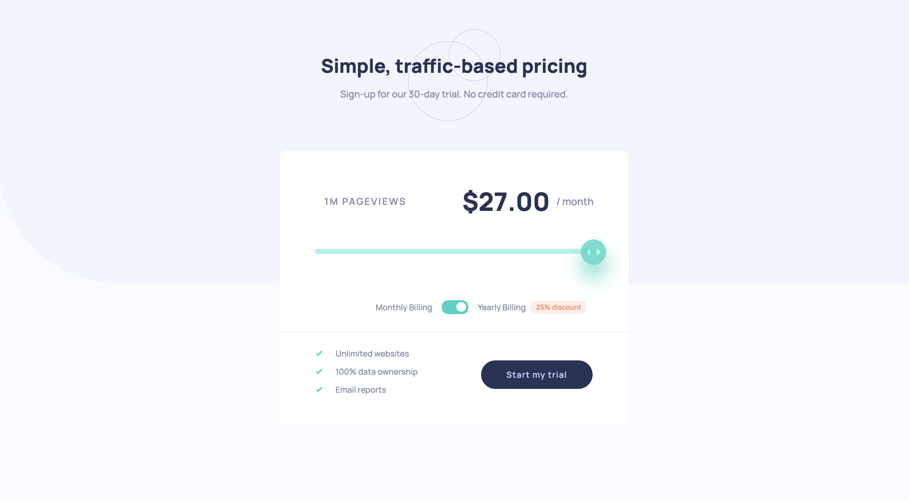
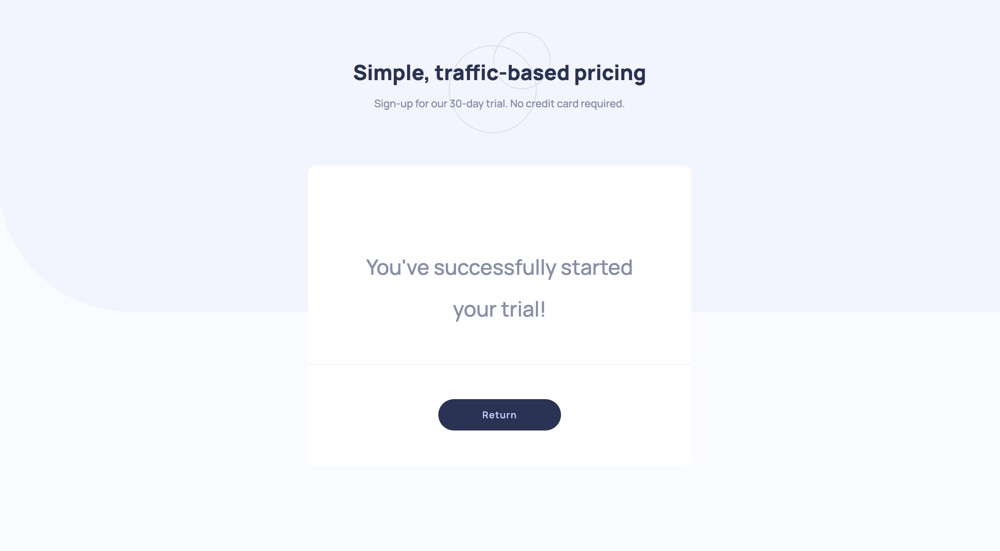

# Frontend Mentor - Interactive pricing component solution

This is a solution to the [Interactive pricing component challenge on Frontend Mentor](https://www.frontendmentor.io/challenges/interactive-pricing-component-t0m8PIyY8). Frontend Mentor challenges help you improve your coding skills by building realistic projects. 

## Table of contents

- [Overview](#overview)
  - [The challenge](#the-challenge)
  - [Screenshot](#screenshot)
  - [Links](#links)
- [My process](#my-process)
  - [Built with](#built-with)
  - [What I learned](#what-i-learned)
  - [Continued development](#continued-development)
- [Author](#author)

**Note: Delete this note and update the table of contents based on what sections you keep.**

## Overview

### The challenge

Users should be able to:

- View the optimal layout for the app depending on their device's screen size
- See hover states for all interactive elements on the page
- Use the slider and toggle to see prices for different page view numbers

### Screenshot

<table>
    <tr>
        <td>
            
            
        </td>
    </tr>
    <tr>
        <td>
            
        </td>
    </tr>
    <tr>
        <td>
            
        </td>
    </tr>
</table>

### Links

- Solution URL: [here](https://www.frontendmentor.io/solutions/)
- Live Site URL: [here](https://zun-liang.github.io/interactive-pricing-component/)

## My process

### Built with

- HTML5
- CSS3
- Flexbox
- Mobile-first workflow
- React.js
- React Slider

### What I learned

- React Slider

### Continued development

- React hooks
- API

## Author

- Website - [Zun Liang](https://zun-liang.github.io/)
- Frontend Mentor - [@zun-liang](https://www.frontendmentor.io/profile/zun-liang)
